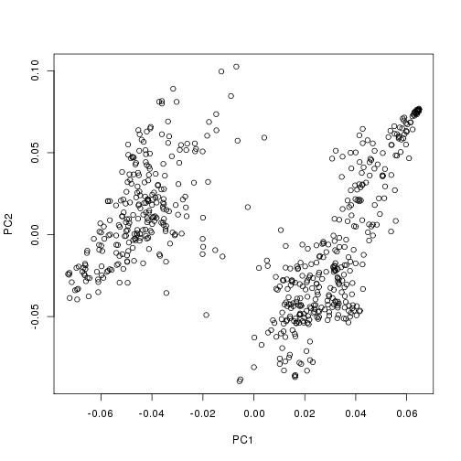
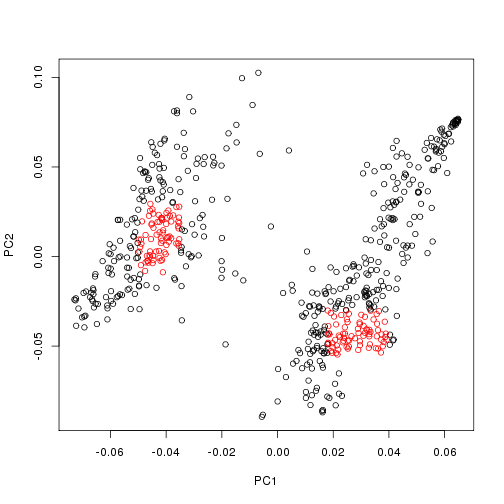

**Script: 1-test_w_bglr.R**

- *Author: Scott Funkhouser*
- *Date: 20151102*
- *Project: [Genomic_prediction](../../../README.md)*
- *Sub Folder: [wheat_dataset](../../wheat_dataset.md)*

**Table of contents:**

1. [Objectives](#objectives)
2. [Install libraries](#install-libraries)
3. [Load data](#load-data)
4. [Analysis](#analysis)
	- [Cluster and estimate composition](#cluster-and-estimate-composition)
	- [Fit gBLUP model](#fit-gblup-model)

<br />
## Objectives
Test methodology for the analysis of heterogeneous populations using genomic predictions.
Methods are intended to be a modification of those in
"Incorporating Genetic Heterogeneity in Whole-Genome Regressions Using Interactions".
by Gustavo de los Compos et al. This will involve:

1. Clustering wheat strains by PCA (as in the paper)
2. Sampling individuals that represent the center of each cluster to build a reference panel of
	allele frequencies used in breed/strain composition estimation.
3. Estimate composition of all samples using these references.
4. Figure out a way to implement these breed composition estimates into the model proposed in the
	aforementioned paper.


```r
setwd("/mnt/research/pigsnp/NSR/Genomic_prediction/wheat_dataset/scripts")
```

<br />
## Install libraries


```r
library(breedTools)
library(magrittr)
# devtools::install_github("gdlc/BGLR-R")
library(BGLR)

sessionInfo()
```

```
## R version 3.1.0 (2014-04-10)
## Platform: x86_64-unknown-linux-gnu (64-bit)
## 
## locale:
##  [1] LC_CTYPE=en_US.UTF-8       LC_NUMERIC=C              
##  [3] LC_TIME=en_US.UTF-8        LC_COLLATE=en_US.UTF-8    
##  [5] LC_MONETARY=en_US.UTF-8    LC_MESSAGES=en_US.UTF-8   
##  [7] LC_PAPER=en_US.UTF-8       LC_NAME=C                 
##  [9] LC_ADDRESS=C               LC_TELEPHONE=C            
## [11] LC_MEASUREMENT=en_US.UTF-8 LC_IDENTIFICATION=C       
## 
## attached base packages:
## [1] stats     graphics  grDevices utils     datasets  base     
## 
## other attached packages:
## [1] BGLR_1.0.5     magrittr_1.5   breedTools_0.1 knitr_1.11    
## 
## loaded via a namespace (and not attached):
## [1] evaluate_0.8   formatR_1.2.1  methods_3.1.0  quadprog_1.5-5
## [5] stringi_1.0-1  stringr_1.0.0  tools_3.1.0
```

<br />
## Load data
Provided by BGLR package, a dataset consisting of 599 pure lines of wheat genotyped
	at 1279 DArT markers.


```r
data(wheat)
```

Inspect wheat dataset components.


```r
ls()
```

```
## [1] "args"       "file_name"  "wheat.A"    "wheat.sets" "wheat.X"   
## [6] "wheat.Y"
```

```r
dim(wheat.X)
```

```
## [1]  599 1279
```

<br />
## Analysis
### Cluster and estimate composition
Center and scale X.


```r
X <- scale(wheat.X, center = TRUE, scale = TRUE)
```

Compute G.


```r
G <- X %*% t(X) / ncol(X)
```

Use PCA to separate wheat groups as done previously.


```r
evd <- eigen(G)
plot(evd$vectors[, 1],
	 evd$vectors[, 2],
	 xlab = "PC1",
	 ylab = "PC2")
```

 

By eye, arbitrarily define the individuals we want to isolate for "breed composition" reference.
Might there be a more precise way to "grap the peaks" from each?


```r
group1_idx <- (evd$vectors[, 1] > -0.05 & evd$vectors[, 1] < -0.035 & evd$vectors[, 2] > -0.01 & evd$vectors[, 2] < 0.03)
group2_idx <- (evd$vectors[, 1] > 0.018 & evd$vectors[, 1] < 0.04 & evd$vectors[, 2] > -0.055 & evd$vectors[, 2] < -0.03)
plot(evd$vectors[, 1],
	 evd$vectors[, 2],
	 xlab = "PC1",
	 ylab = "PC2",
	 col = c("black", "red")[(group1_idx | group2_idx) + 1])
```

 

Allele frequency calculations with breedTools v0.1 requires rownames for genotype matrix X


```r
rownames(wheat.X) <- seq(1, nrow(wheat.X))
```

Solve "breed composition" for each line.


```r
bc <- breedTools::allele_freq(wheat.X, list(group1 = rownames(wheat.X[group1_idx, ]),
									  	  	group2 = rownames(wheat.X[group2_idx, ]))) %>%
		breedTools::solve_composition(wheat.X, .)
```

### Fit gBLUP model
Create linear predictor.


```r
lp <- list(list(V = evd$vectors, d = evd$values, model = 'RKHS'))
```

Fit the model $\textbf{y} = \textbf{Z}\textbf{u} + \textbf{e}$


```r
fit_gblup <- BGLR(y = wheat.Y[, 1],
				  ETA = lp,
				  nIter = 12000,
				  burnIn = 2000,
				  saveAt = "../1-")
```

