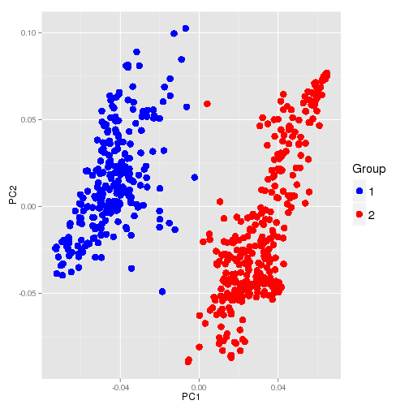

**Script: 1-test_w_bglr.R**

- *Author: Scott Funkhouser*
- *Date: 20151102*
- *Project: [Genomic_prediction](../../../README.md)*
- *Sub Folder: [wheat_dataset](../../wheat_dataset.md)*

**Table of contents:**

1. [Objectives](#objectives)
2. [Install libraries](#install-libraries)
3. [Load data](#load-data)
4. [Analysis](#analysis)
	- [Cluster and estimate composition](#cluster-and-estimate-composition)
	- [Fit gBLUP model](#fit-gblup-model)

## Objectives
Test methodology for the analysis of heterogeneous populations using genomic predictions.
Methods are intended to be a modification of those in
"Incorporating Genetic Heterogeneity in Whole-Genome Regressions Using Interactions".
by Gustavo de los Compos et al. This will involve:

1. Clustering wheat strains by PCA (as in the paper)
2. Sampling individuals that represent the center of each cluster to build a reference panel of
	allele frequencies used in breed/strain composition estimation.
3. Estimate composition of all samples using these references.
4. Figure out a way to implement these breed composition estimates into the model proposed in the
	aforementioned paper.


```r
setwd("/mnt/research/pigsnp/NSR/Genomic_prediction/wheat_dataset/scripts")
```

## Install libraries


```r
library(breedTools)
library(magrittr)
# devtools::install_github("gdlc/BGLR-R")
library(BGLR)
library(ggplot2)
```

```
## Loading required package: methods
```

```r
library(cluster)

sessionInfo()
```

```
## R version 3.1.0 (2014-04-10)
## Platform: x86_64-unknown-linux-gnu (64-bit)
## 
## locale:
##  [1] LC_CTYPE=en_US.UTF-8       LC_NUMERIC=C              
##  [3] LC_TIME=en_US.UTF-8        LC_COLLATE=en_US.UTF-8    
##  [5] LC_MONETARY=en_US.UTF-8    LC_MESSAGES=en_US.UTF-8   
##  [7] LC_PAPER=en_US.UTF-8       LC_NAME=C                 
##  [9] LC_ADDRESS=C               LC_TELEPHONE=C            
## [11] LC_MEASUREMENT=en_US.UTF-8 LC_IDENTIFICATION=C       
## 
## attached base packages:
## [1] methods   stats     graphics  grDevices utils     datasets  base     
## 
## other attached packages:
## [1] cluster_2.0.3  ggplot2_1.0.1  BGLR_1.0.5     magrittr_1.5  
## [5] breedTools_0.1 knitr_1.11    
## 
## loaded via a namespace (and not attached):
##  [1] colorspace_1.2-6 digest_0.6.8     evaluate_0.8     formatR_1.2.1   
##  [5] grid_3.1.0       gtable_0.1.2     kinship2_1.6.4   lattice_0.20-33 
##  [9] MASS_7.3-43      Matrix_1.2-2     munsell_0.4.2    plyr_1.8.3      
## [13] proto_0.3-10     quadprog_1.5-5   Rcpp_0.12.1      reshape2_1.4.1  
## [17] scales_0.3.0     stringi_1.0-1    stringr_1.0.0    tools_3.1.0
```

## Load data
Provided by BGLR package, a dataset consisting of 599 pure lines of wheat genotyped
	at 1279 DArT markers.


```r
data(wheat)
```

Inspect wheat dataset components.


```r
ls()
```

```
## [1] "args"       "file_name"  "wheat.A"    "wheat.sets" "wheat.X"   
## [6] "wheat.Y"
```

```r
dim(wheat.X)
```

```
## [1]  599 1279
```

## Analysis
### Cluster and estimate composition
Center and scale X.


```r
X <- scale(wheat.X, center = TRUE, scale = TRUE)
y <- wheat.Y[, 1]
```

Compute G.


```r
G <- X %*% t(X) / ncol(X)
```

Identify groups using partitioning around medoids.


```r
c <- pam(G, 2)
```

Use PCA to separate wheat groups as done previously.


```r
evd <- eigen(G)
pcs <- as.data.frame(evd$vectors)
colnames(pcs) <- paste(rep("PC", ncol(pcs)), seq(1:ncol(pcs)), sep = '')
pcs <- cbind("cluster" = c$clustering, pcs)
```

Plot according to clustering.


```r
ggplot(pcs, aes(x = PC1, y = PC2, color = factor(cluster))) +
	geom_point(size = 4, alpha = 1) + 
		scale_color_manual(values = c("blue", "red")) + 
			theme(legend.position = "none")
```

 

Identify medoids.


```r
med1 <- apply(G, 1, function(x) identical(x, c$medoids[1, ]))
med2 <- apply(G, 1, function(x) identical(x, c$medoids[2, ]))
p1 <- pcs[med1, c("PC1", "PC2")]
p2 <- pcs[med2, c("PC1", "PC2")]
```

Take x number of points within an arbitrary radius of each medoid.


```r
ref1 <- dist(rbind(p1, pcs[, c("PC1", "PC2")]))[1:599] < 0.015
ref2 <- dist(rbind(p2, pcs[, c("PC1", "PC2")]))[1:599] < 0.015
```

Observe chosen reference samples from each cluster.


```r
plot(pcs[, "PC1"],
	 pcs[, "PC2"],
	 xlab = "PC1",
	 ylab = "PC2",
	 col = c("black", "red")[(ref1 | ref2) + 1])
```

 

Allele frequency calculations with breedTools v0.1 requires rownames for genotype matrix X


```r
rownames(wheat.X) <- seq(1, nrow(wheat.X))
```

Solve "breed composition" for each line.


```r
bc <- breedTools::allele_freq(wheat.X, list(group1 = rownames(wheat.X[ref1, ]),
									  	  	group2 = rownames(wheat.X[ref2, ]))) %>%
		breedTools::solve_composition(wheat.X, .)
```

Obtain "purity" of group 1.


```r
prob <- bc[, 1]
```

Re-plot and color according to "group purity".


```r
pcs <- cbind("Group1_Comp" = prob, pcs)

ggplot(pcs, aes(x = PC1, y = PC2, color = Group1_Comp)) +
	geom_point(size = 4, alpha = 0.7) +
		scale_color_gradient(low = "red", high = "blue")
```

 

### Fit gBLUP model


```r
X0 <- X
X1 <- X
X2 <- X

for (i in 1:nrow(X1)) { 
  X1[i, ] <- X1[i, ] * prob[i]
  X2[i, ] <- X2[i, ] * (1 - prob[i])
}
```

Standardize each incidence matrix.


```r
X0 <- scale(X0) / sqrt(ncol(X0))
X1 <- scale(X1) / sqrt(ncol(X1))
X2 <- scale(X2) / sqrt(ncol(X2))
```

Create linear predictor.


```r
ETA <- list(main = list(X = X0, model = 'BRR', df0 = .1),
  		    int1 = list(X = X1, model = 'BRR', df0 = .1),
  		    int2 = list(X = X2, model = 'BRR', df0 = .1))
```

Fit the model.


```r
fm <- BGLR(y = y,
		   ETA = ETA,
		   nIter = 24000,
		   burnIn = 2000,
		   groups = ifelse(prob > .5, 1, 2), df0 = .1,
		   saveAt = "../1-")

varU0 <- fm$ETA$main$varB
varU1 <- fm$ETA$int1$varB
varU2 <- fm$ETA$int2$varB
COR <- varU0 / sqrt((varU0 + varU1) * (varU0 + varU2))

fm$varE
```

